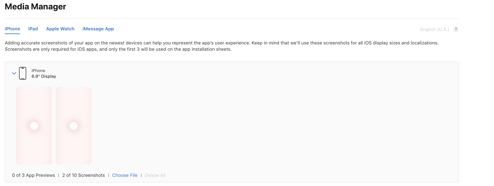
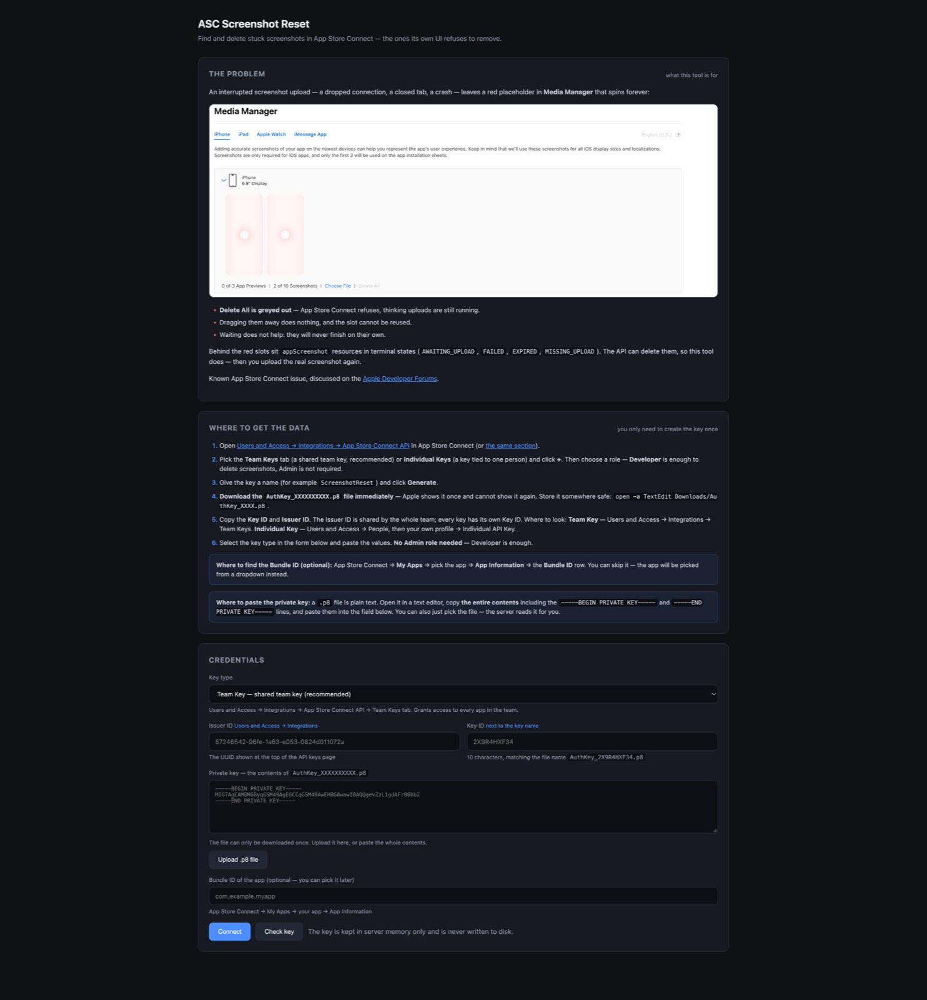

# ASC Screenshot Reset

A local Node.js/TypeScript web server that finds and deletes **stuck screenshots** in App Store Connect — the ones App Store Connect refuses to let you remove through its own UI.

A browser-based counterpart to the Python `asc_screenshot_reset.py` script: same API calls, no terminal flags, no files to edit.

## The problem

In **Media Manager**, a screenshot upload can get interrupted — a dropped connection, a browser tab closed mid-upload, a crash — and leave a red placeholder that spins forever:



Look at the two red slots in the screenshot above. Note what you **cannot** do with them:

- **Delete All is greyed out** — App Store Connect refuses to remove them, because it believes the uploads are still in progress.
- Dragging them away does nothing.
- Re-uploading to the same slot fails, since the slot is occupied.
- Waiting does not help: these are not going to finish on their own.

The slot stays occupied and the app cannot be submitted for review with the set in this state. There is no UI escape hatch.

Behind the scenes, each placeholder is an `appScreenshot` resource in a terminal state — `AWAITING_UPLOAD` (a reservation was created but the file never arrived), `FAILED`, `EXPIRED` or `MISSING_UPLOAD`. Apple simply does not expose a way to delete those through the web interface.

This is a known and long-standing App Store Connect problem, discussed here:

> **[Media Manager stuck screenshot placeholders — Developer Forums](https://developer.apple.com/forums/thread/848464?login=true&r_s_legacy=true&page=1)**

## What this solves

The resources *can* be deleted — just not from the UI. This tool goes through the official [App Store Connect API](https://developer.apple.com/documentation/appstoreconnectapi) and issues `DELETE /v1/appScreenshots/{id}`, which removes the placeholder and frees the slot so you can upload a real screenshot again.

In short:

| | App Store Connect UI | This tool |
|---|---|---|
| Remove a stuck placeholder | ✕ Delete All is disabled | ✓ `DELETE /v1/appScreenshots/{id}` |
| Find which ones are stuck | ✕ shows identical red slots | ✓ shows the real state per screenshot |
| See the underlying reason | ✕ | ✓ `AWAITING_UPLOAD`, `FAILED`, `EXPIRED`, … |
| Recover the slot | ✕ | ✓ upload again immediately after |

It also lists **every** screenshot in every set — locale, display type and delivery state — so you can tell a stuck placeholder from a legitimately uploaded image before deleting anything.

> ⚠️ This deletes **only the metadata and the asset inside App Store Connect**. It makes no backup of the images, so re-upload the files yourself afterwards.

## How it works

1. **Authentication.** Credentials go into the web form: Issuer ID, Key ID and the contents of the `AuthKey_XXXX.p8` file. The server signs an ES256 JWT (`aud=appstoreconnect-v1`, 19-minute TTL) and caches it.
2. **Scanning.** Walks the tree `apps → appStoreVersions → appStoreVersionLocalizations → appScreenshotSets → appScreenshots` across every version, locale and display type.

   > **API constraints:** `GET_COLLECTION` is not allowed on `appScreenshotSets` (only `CREATE`, `DELETE`, `GET_INSTANCE`), and the `appScreenshotSets` relationship exists only on `appStoreVersionLocalizations`. Sets are therefore read through the version localization, and each set's attributes come from a separate `GET_INSTANCE`.
3. **Classification.** Every screenshot gets a verdict:
   | Verdict | Condition |
   |---|---|
   | `stuck` | `FAILED`, `EXPIRED`, `MISSING_UPLOAD`, `AWAITING_UPLOAD`, or `PROCESSING`/`UPLOAD_COMPLETE` for over an hour |
   | `processing` | fresh `PROCESSING`/`UPLOAD_COMPLETE` — usually clears itself |
   | `ok` | `COMPLETE` |
4. **Deletion.** Tick what you need (or all stuck ones) → `DELETE /v1/appScreenshots/{id}`. There is also an endpoint for dropping an entire set — `DELETE /v1/appScreenshotSets/{id}`.

## Running it

Requires **Node.js 20.11 or newer**.

```bash
git clone git@github.com:smmaxim1987/asc-screenshot-fixer.git
cd asc-screenshot-fixer
npm install
npm run dev
```

Then open **http://127.0.0.1:8787** and paste your Issuer ID, Key ID and `.p8` key into the form.



Everything is on a single page — the explanation of the problem, the step-by-step instructions for getting the key, and the credentials form itself:

- **The problem** explains what a stuck screenshot is and why App Store Connect will not delete it.
- **Where to get the data** lists the exact pages to visit, with links.
- **Credentials** takes the Issuer ID, Key ID and the `.p8` key, with an **Upload .p8 file** button that reads the file from disk and fills in the Key ID automatically.

Production build:

```bash
npm run build
npm start
```

Configuration is optional — copy `.env.example` to `.env` to change the port or bind address:

| Variable | Default | Meaning |
|---|---|---|
| `PORT` | `8787` | Local server port |
| `HOST` | `127.0.0.1` | Bind address — keep it local |
| `ASC_API_BASE_URL` | `https://api.appstoreconnect.apple.com` | API base URL |

> The server listens on `127.0.0.1` on purpose. Your private key is entered through the page, so do not expose the port to the network.

## Getting a key

The step-by-step instructions with links are built into the interface itself — see the "Where to get the data" block on the main page. In short:

App Store Connect → **Users and Access → Integrations → App Store Connect API**:
1. Create a key with the **Developer** role (Admin is not needed to read or delete screenshots).
2. Download the `.p8` — it can be obtained **only once**, so store it safely.
3. Copy the **Key ID** and **Issuer ID** from the same page.

The form explains where each field comes from and can **upload the `.p8` straight from disk**, filling in the Key ID from the file name automatically (`AuthKey_2X9R4HXF34.p8`), so there is nothing to look up by hand.

## Team Key vs Individual Key

Both types are supported — pick between them with the **Key type** dropdown.

| | Team Key | Individual Key |
|---|---|---|
| Where it is created | Integrations → Team Keys | User profile → Individual API Key |
| Access | **Every app in the team** | Apps and permissions of that user |
| Admin required | No | No |
| JWT detail | — | **`sub: "user"` claim is required** |

A **Team Key** is the better choice here: it does not depend on which apps a particular employee has open, and it does not break when staff change or app access is revoked.

An **Individual Key** is limited by the user's permissions: if an employee has no access to the target app, the key will not see it either. Such keys are also unavailable in the Enterprise Program.

The role required in both cases is **Developer** (or higher). Admin is not needed.

### If the key type is wrong

A `403` on an otherwise valid key often means exactly that the wrong type was selected. Per Apple's documentation an individual key's payload requires the `sub: "user"` claim, while a Team Key must not have it — a mismatch returns 403.

The **"Check key"** button, on a 403 from `/v1/apps`, automatically tries the opposite type and, if that works, **fills the right one into the form**. No manual guessing needed.

## If you get a 401

`401 Authentication credentials are missing or invalid` means Apple rejected the **token itself**, not that permissions are missing. Press **"Check key"** for a step-by-step report.

Most common causes:

| Cause | How to tell |
|---|---|
| **Team ID entered instead of Issuer ID** | They look alike, but the Issuer ID is a 36-character UUID. Diagnostics flag this separately |
| **`.p8` does not match the Key ID** | `AuthKey_2X9R4HXF34.p8` must go with Key ID `2X9R4HXF34` |
| **Key was revoked** | It was deleted in App Store Connect — create a new one |
| **System clock is off** | The token goes out with a wrong `iat`/`exp` |

## If you get "fetch failed" or the app list does not load

This is **not** a key problem. Node collapses every network error into `fetch failed`, but the real cause is always one of these:

| Symptom | Cause | What to do |
|---|---|---|
| `getaddrinfo ENOTFOUND` | The macOS system DNS resolver is broken | System Settings → Network → your network → Details → DNS → `1.1.1.1` or `8.8.8.8` |
| `ECONNRESET` / socket hang up | A VPN or corporate proxy breaks TLS | Disable the VPN or switch networks |
| 30-second timeout | Slow connection | Retry; raise the timeout if it persists |

**How to check, in increasing order of complexity:**

```bash
# 1. Does the internet work at all
curl -sI https://www.apple.com | head -1

# 2. Does the name resolve (system resolver, as used by Node)
nslookup api.appstoreconnect.apple.com

# 3. Does the API itself answer
curl -sI https://api.appstoreconnect.apple.com/v1/territories | head -1
```

The key detail: `dig` may work while `getaddrinfo` does not. Node uses `getaddrinfo`, so `ping`/`node` report "Unknown host" even though `dig` answers. If that happens, switch the system DNS.

The app now **retries network failures automatically** (4 attempts with growing backoff) and reports the decoded cause instead of `fetch failed`. Diagnostics start with a "Network to Apple" check, so a network problem is always told apart from a key problem immediately.

## If you get "does not allow GET_COLLECTION"

```
The given operation is not allowed: The resource 'appScreenshotSets'
does not allow 'GET_COLLECTION'. Allowed operations are: CREATE, DELETE, GET_INSTANCE
```

This is **not a permissions problem** but a wrong endpoint — `appScreenshotSets` simply has no direct listing operation. The full traversal is explained in the next section.

## If you get an invalid URL path error

```
The URL path is not valid: The relationship 'appScreenshotSets' does not exist
```

There is **no** `appScreenshotSets` relationship on `appStoreVersions` — screenshot sets hang off the **version localization**. The correct traversal is:

```
/v1/apps/{id}/appStoreVersions                               → versions
/v1/appStoreVersions/{versionId}/appStoreVersionLocalizations → version localizations
/v1/appStoreVersionLocalizations/{locId}/appScreenshotSets    → set IDs
/v1/appScreenshotSets/{setId}                                 → set attributes (GET_INSTANCE)
/v1/appScreenshotSets/{setId}/appScreenshots                  → screenshots in the set
```

Two API limitations force this shape:

1. `/v1/appScreenshotSets` **does not support `GET_COLLECTION`** — only `CREATE`, `DELETE`, `GET_INSTANCE`.
2. There is no `appScreenshotSets` relationship on either `apps` or `appStoreVersions` — only on `appStoreVersionLocalizations`.

## The `assetDeliveryState` format

The field arrives as an **object**, not a string:

```json
"assetDeliveryState": { "state": "COMPLETE" }
```

This is easy to get wrong, producing `UNKNOWN` and losing every screenshot. It is normalised in `deliveryStateOf()` in `src/asc/screenshots.ts`.

A typical stuck screenshot looks like this:

```text
fileName: 2.jpg
state: AWAITING_UPLOAD
sourceFileChecksum: null
width: 0
height: 0
uploadOperations: []
```

## If you get a 403 (no access)

`403 Forbidden` means Apple refuses access to the requested resource. **Important: with an Admin-role key, a 403 almost never means "not enough permissions"** — an Admin can access everything.

Press **"Check key"**: it makes three probe requests and shows exactly at which level access breaks.

| Probe | What it proves |
|---|---|
| `/v1/territories` | Needs no permissions. Success means the token is accepted — from there on it is purely about access |
| `/v1/apps` | Whether the team's app list is reachable |
| `/v1/users` | Available only to Admin/Account Holder — confirms the role |

Likely causes of a 403 on an Admin key:

1. **The Issuer ID belongs to a different team.** This is the most common one: the token is signed correctly but belongs to someone else's account.
2. **No active App Store Agreement** in App Store Connect, or the account status is Pending.
3. **The app was created in a different team.**

Separately: a 403 on `/v1/users` alongside a successful `/v1/apps` is normal and breaks nothing. The Developer and App Manager roles behave that way, and they are sufficient for deleting screenshots.

If every probe returned 401, the problem is the token, not the permissions.

## Security

- The private key lives **in process memory only** — it is never written to disk and is not persisted in the browser (the field is cleared after connecting).
- Sessions live for 12 hours and **are lost on server restart** — this is deliberate.
- The server listens on `127.0.0.1` by default. Do not set `HOST=0.0.0.0` without restricting port access: anyone who can open the page can act on your account.
- The token never appears in a URL or in logs — only in the `Authorization` header.

## Server API

| Method | Path | Purpose |
|---|---|---|
| `POST` | `/api/session` | Validates credentials, returns `sessionId` and the app list |
| `POST` | `/api/diagnose` | Full key check plus a test request to Apple |
| `POST` | `/api/session/validate` | Swap credentials without reconnecting |
| `DELETE` | `/api/session` | Destroys the session |
| `GET` | `/api/apps` | Lists the account's apps |
| `GET` | `/api/scan?appId=…` | Full screenshot scan |
| `DELETE` | `/api/screenshots/:id` | Delete one screenshot |
| `POST` | `/api/screenshots/delete` | Bulk delete `{ ids: [...] }`, up to 200 at a time |
| `DELETE` | `/api/screenshot-sets/:id` | Delete an entire set |

The session is passed via the `X-Session-Id` header.

## Structure

```
src/
  types.ts                  domain types and statuses
  session.ts                credentials schema, in-memory session storage
  server.ts                 Express: static files + REST
  asc/
    auth.ts                 .p8 → ES256 JWT signing, token cache keyed by fingerprint
    pem.ts                  normalises .p8 contents into a valid PEM PKCS#8
    diagnose.ts             step-by-step key diagnostics and 401/403 breakdown
    client.ts               HTTP client: 401/429/5xx retries, links.next pagination
    concurrency.ts          parallelism limiter for API traversal
    screenshots.ts          tree traversal, classification, deletion
public/                     UI with no bundler and no framework
```

## Limitations and assumptions

- The "stuck PROCESSING" threshold is 1 hour (`PROCESSING_STUCK_AFTER_MS` in `src/asc/screenshots.ts`). Adjust it if your connection is slow.
- Scanning runs in batches of 5 sets: the ASC API allows ~3600 requests/hour per key, so walking dozens of sets sequentially would risk hitting the limit.
- Locale and platform come from the version and localization resources; if those lookups fail the fields stay `null`, which does not affect deletion logic.
- `findApp` relies on `filter[bundleId]`; if Apple ever returned several apps with the same bundle ID (it should not), the first one is used.
- Only screenshots can be deleted through the API. Stuck **app previews** (`appPreviews`) need a separate traversal — not implemented here.